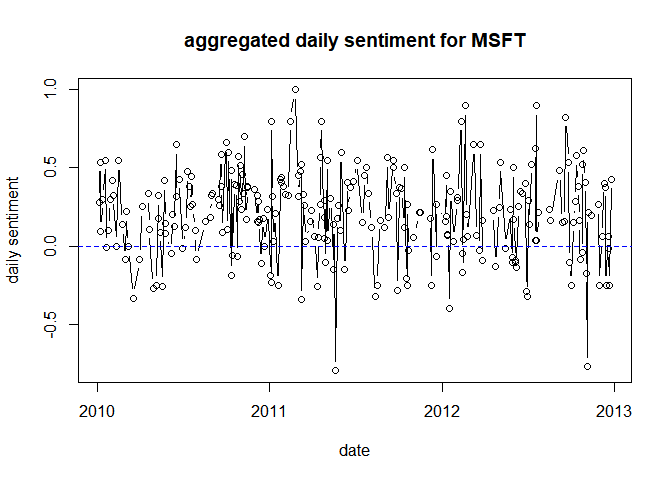
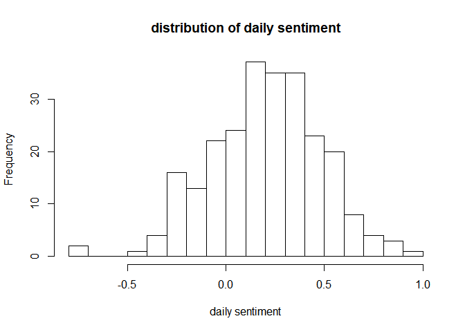
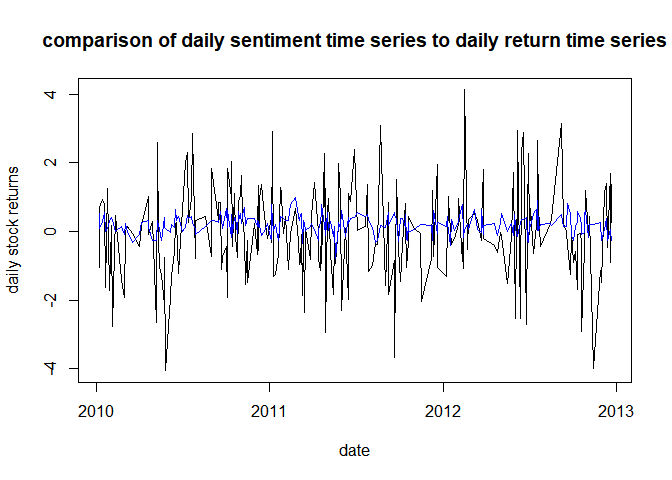

correlation of stock sentiment and returns
================
Sarp Uslu
November 7, 2018

Loading Reuters News articles:

``` r
load("msftRNA2010-2012.Rdata")
soi = "MSFT"

#RNA returns some non-articles like alert headers that doesn't have a text body
#keep the stuff that has a body
rowsWithActualText = rnaData[which(rnaData$take_text != ""),]
#RNA returns texts that are out of order in terms of time. line below puts in order
rowsWithActualText = rowsWithActualText[order(rowsWithActualText$msg_date, rowsWithActualText$msg_time),]
```

Creating a corpus and document term matrix:

``` r
#creating a corpus and document term matrix ###########################################

myCorpus = Corpus(VectorSource(rowsWithActualText$take_text))
# convert to lower case
myCorpus <- tm_map(myCorpus, content_transformer(tolower))# apply transformation functions (also denoted as mappings) to corpora
# remove URLs
removeURL <- function(x) gsub("http[^[:space:]]*", "", x)
myCorpus <- tm_map(myCorpus, content_transformer(removeURL))
# remove anything other than English letters or space
removeNumPunct <- function(x) gsub("[^[:alpha:][:space:]]*", "", x)
myCorpus <- tm_map(myCorpus, content_transformer(removeNumPunct))
# remove punctuation
myCorpus <- tm_map(myCorpus, removePunctuation)
# remove numbers
myCorpus <- tm_map(myCorpus, removeNumbers)
# Stopwords are commonly used words in the English language such as I, me, my, etc. 
# You can see the full list of stopwords using stopwords('english').
# add two extra stop words: "available" and "via"
myStopwords <- c(stopwords('english'), "available", "via")# available stopword lists are catalan, romanian, SMART
# remove stopwords from corpus
myCorpus <- tm_map(myCorpus, removeWords, myStopwords)
# remove extra whitespace
myCorpus <- tm_map(myCorpus, stripWhitespace)
# Constructs a term-document matrix or a document-term matrix
tdm <- TermDocumentMatrix(myCorpus,
                          control = list(wordLengths = c(1, Inf)))
```

Here is how a typical article would look like after this process:

``` r
myCorpus[[9]]$content
```

    ## [1] " microsoft asks full panel judges review case will still adjust word comply injunction las vegas jan reuters microsoft corp msfto friday asked full panel judges review recent appeals court decision uphold million jury verdict infringing patent held small canadian software firm worlds largest software company wants judges united states court appeals federal circuit handles many patent trademark cases review longrunning case torontobased ii ltd hope overturning original judgment microsoft already appealed case last year december panel three appeals court judges rejected arguments upholding original federal jury decision august jury us district court texas ruled microsoft infringed patent belonging ii relating text manipulation software versions word microsofts word processing application jury slapped million damages microsoft court granted iis motion injunction preventing microsoft selling versions word contain disputed patent technology injunction stayed microsoft appealed case court appeals now set go effect jan microsofts first unsuccessful appeal microsoft said last month working adjust current versions word comply injunction said friday will continue work despite new appeal look forward next steps court considers petition continuing move ahead plans comply injunction jan microsoft spokesman kevin kutz microsofts appeal based belief appeal court decision december conflicts precedents trial procedure establishing damages patent cases kutz said representative ii immediately respond request comment microsoft shares closed percent nasdaq case ii limited partnership infrastructures information inc v microsoft corp appeal us district court eastern district texas case cv reporting bill rigby editing richard chang billrigbythomsonreuterscom reuters messaging billrigbyreuterscomreutersnet keywords microsoftappeal "

Here are the tokenized words for this particular article:

``` r
get_tokens(myCorpus[[9]]$content)[hunspell_check(get_tokens(myCorpus[[5]]$content))]
```

    ##   [1] "panel"                         "review"                       
    ##   [3] "case"                          "still"                        
    ##   [5] "adjust"                        "word"                         
    ##   [7] "comply"                        "injunction"                   
    ##   [9] "las"                           "vegas"                        
    ##  [11] "jan"                           "reuters"                      
    ##  [13] "msfto"                         "friday"                       
    ##  [15] "asked"                         "full"                         
    ##  [17] "panel"                         "judges"                       
    ##  [19] "review"                        "court"                        
    ##  [21] "decision"                      "uphold"                       
    ##  [23] "million"                       "verdict"                      
    ##  [25] "infringing"                    "held"                         
    ##  [27] "software"                      "worlds"                       
    ##  [29] "largest"                       "software"                     
    ##  [31] "company"                       "wants"                        
    ##  [33] "judges"                        "united"                       
    ##  [35] "states"                        "appeals"                      
    ##  [37] "federal"                       "circuit"                      
    ##  [39] "handles"                       "patent"                       
    ##  [41] "trademark"                     "torontobased"                 
    ##  [43] "ltd"                           "hope"                         
    ##  [45] "original"                      "judgment"                     
    ##  [47] "microsoft"                     "already"                      
    ##  [49] "appealed"                      "case"                         
    ##  [51] "last"                          "year"                         
    ##  [53] "december"                      "appeals"                      
    ##  [55] "court"                         "judges"                       
    ##  [57] "rejected"                      "arguments"                    
    ##  [59] "upholding"                     "original"                     
    ##  [61] "decision"                      "august"                       
    ##  [63] "jury"                          "us"                           
    ##  [65] "court"                         "texas"                        
    ##  [67] "microsoft"                     "belonging"                    
    ##  [69] "relating"                      "text"                         
    ##  [71] "manipulation"                  "software"                     
    ##  [73] "versions"                      "word"                         
    ##  [75] "microsofts"                    "word"                         
    ##  [77] "application"                   "jury"                         
    ##  [79] "slapped"                       "million"                      
    ##  [81] "microsoft"                     "court"                        
    ##  [83] "preventing"                    "selling"                      
    ##  [85] "versions"                      "contain"                      
    ##  [87] "disputed"                      "patent"                       
    ##  [89] "technology"                    "injunction"                   
    ##  [91] "stayed"                        "microsoft"                    
    ##  [93] "appealed"                      "case"                         
    ##  [95] "now"                           "set"                          
    ##  [97] "go"                            "effect"                       
    ##  [99] "jan"                           "microsofts"                   
    ## [101] "first"                         "microsoft"                    
    ## [103] "said"                          "last"                         
    ## [105] "month"                         "adjust"                       
    ## [107] "current"                       "word"                         
    ## [109] "said"                          "will"                         
    ## [111] "continue"                      "work"                         
    ## [113] "despite"                       "new"                          
    ## [115] "appeal"                        "look"                         
    ## [117] "forward"                       "steps"                        
    ## [119] "court"                         "considers"                    
    ## [121] "petition"                      "move"                         
    ## [123] "ahead"                         "microsoft"                    
    ## [125] "kevin"                         "kutz"                         
    ## [127] "appeal"                        "based"                        
    ## [129] "belief"                        "appeal"                       
    ## [131] "court"                         "decision"                     
    ## [133] "december"                      "conflicts"                    
    ## [135] "precedents"                    "establishing"                 
    ## [137] "damages"                       "patent"                       
    ## [139] "cases"                         "kutz"                         
    ## [141] "said"                          "representative"               
    ## [143] "respond"                       "request"                      
    ## [145] "comment"                       "microsoft"                    
    ## [147] "closed"                        "percent"                      
    ## [149] "case"                          "partnership"                  
    ## [151] "information"                   "inc"                          
    ## [153] "v"                             "microsoft"                    
    ## [155] "corp"                          "appeal"                       
    ## [157] "us"                            "district"                     
    ## [159] "eastern"                       "district"                     
    ## [161] "texas"                         "case"                         
    ## [163] "reporting"                     "bill"                         
    ## [165] "billrigbythomsonreuterscom"    "messaging"                    
    ## [167] "billrigbyreuterscomreutersnet" "microsoftappeal"

Calculating sentiment for every article using a sentiment dictionary for each word:
$$Sentiment(i) = \\frac{1}{n(i)} \\sum\_{j=1}^{n(i)} sentimentScore(j)$$
 Where n(i) is the number of words in the article i that has a sentimentScore in sentiment dictionary. sentimentScore(i) is the sentiment score of the jth word.

``` r
# calculate sentiment of corpus texts ###################################
 
corpusSentimentSum = vector(mode = "numeric", length = length(myCorpus))
corpusSentimentAvg = vector(mode = "numeric", length = length(myCorpus))

#this loop goes thru all articles, tokenizes articles into words, 
#keeps english words, get the sentiment of words and 
#calculate the mean and sum word sentiment scores for each article
for(i in 1:length(myCorpus)){
  sentVectorArticle = get_sentiment(get_tokens(myCorpus[[i]]$content)[hunspell_check(get_tokens(myCorpus[[i]]$content))])
  sentVectorArticle = sentVectorArticle[which(sentVectorArticle != 0)]
  corpusSentimentSum[i] = sum(sentVectorArticle)
  corpusSentimentAvg[i] = mean(sentVectorArticle)
}

#this new table holds date, time, pnac idenfifier, sum & mean sentiment scores for each article
#pnac is a unique identifier (key) for each article
rnaSentiment = cbind(rowsWithActualText$msg_date, as.character(rowsWithActualText$msg_time),
                     as.character(rowsWithActualText$pnac), corpusSentimentSum, corpusSentimentAvg)
colnames(rnaSentiment) = c("msg_date", "msg_time", "pnac", "sentimentSum", "sentimentAvg")
rnaSentiment = data.frame(rnaSentiment)

#remove duplicate pnac articles ###############################
# updates to articles share the same pnac identifier as the main article
# simplify stuff and only keep the first entry (main article)
rnaSentDayAgg = NULL
for(i in 1:nrow(rnaSentiment)){
  currentPnac = rnaSentiment$pnac[i]
  if(is.na(currentPnac)){
    next()
  }
  rnaSentiment[which(rnaSentiment$pnac == currentPnac)[-1], ] = NA
}
rnaSentiment = na.omit(rnaSentiment)
```

At this point every article in the corpus has a sentiment score denoted by sentimentAvg:

``` r
head(rnaSentiment)
```

    ##      msg_date     msg_time       pnac sentimentSum       sentimentAvg
    ## 2  2010-01-05 14:59:19.231 nN05245485            1                0.5
    ## 3  2010-01-05 15:14:27.275 nLDE6041GJ         0.95 0.0633333333333333
    ## 5  2010-01-07 04:10:19.431   nWEN8096         2.15             0.5375
    ## 9  2010-01-08 22:00:53.410 nN08258722         4.25  0.103658536585366
    ## 10 2010-01-08 22:47:20.104 nN08261618          2.9 0.0878787878787879
    ## 11 2010-01-12 12:34:20.406  nWNAB3288            0                NaN

We can also aggregate these sentiment scores daily:

``` r
#daily aggregation ######################

#gather unique dates available in data
factorizedDates = levels(as.factor(rnaSentiment$msg_date))
#distinct dates will be out of order so sort them
sortFactorDates = sort(as.Date(factorizedDates))

#for those distinct dates aggregate the sentiment daily by averaging the sentiment of articles within that day
aggregatedSentiment = data.frame(matrix(nrow = length(factorizedDates), ncol = 2))
aggregatedSentiment[,1] = as.Date(sortFactorDates)
for(i in 1:nrow(aggregatedSentiment)){
  indecesToAgg = which(as.Date(rnaSentiment$msg_date) == aggregatedSentiment[i,1])
  aggregatedSentiment[i,2] = mean(as.numeric(as.character(rnaSentiment$sentimentAvg[indecesToAgg])))
}
colnames(aggregatedSentiment) = c("date", "aggDailySentiment")
aggregatedSentiment = na.omit(aggregatedSentiment)
dailySentTS = ts(aggregatedSentiment, freq = 252)
```

Here is the daily sentiment time series:

``` r
plot(aggregatedSentiment$date, aggregatedSentiment$aggDailySentiment, type = "b", 
    xlab = "date", ylab = "daily sentiment", main = "aggregated daily sentiment for MSFT")
abline(h = 0, col = "blue", lty = 2)
```



Here is the distribution of daily sentiment:

``` r
hist(aggregatedSentiment$aggDailySentiment, breaks = 20, xlab = "daily sentiment",
     main = "distribution of daily sentiment")
```



Collect stock returns for the days that we have sentiment scores:

``` r
# get stock prices##############################################

#get the stock prices for the date range of aggregated sentiment of RNA articles
stockPrices = getSymbols(soi, src = "yahoo", auto.assign = FALSE, from = range(aggregatedSentiment[,"date"])[1], to = range(aggregatedSentiment[,"date"])[2])
```

    ## 'getSymbols' currently uses auto.assign=TRUE by default, but will
    ## use auto.assign=FALSE in 0.5-0. You will still be able to use
    ## 'loadSymbols' to automatically load data. getOption("getSymbols.env")
    ## and getOption("getSymbols.auto.assign") will still be checked for
    ## alternate defaults.
    ## 
    ## This message is shown once per session and may be disabled by setting 
    ## options("getSymbols.warning4.0"=FALSE). See ?getSymbols for details.

    ## 
    ## WARNING: There have been significant changes to Yahoo Finance data.
    ## Please see the Warning section of '?getSymbols.yahoo' for details.
    ## 
    ## This message is shown once per session and may be disabled by setting
    ## options("getSymbols.yahoo.warning"=FALSE).

``` r
idxStockPrices = index(stockPrices)
stockPrices = data.frame(stockPrices)
stockPrices$date = as.Date(idxStockPrices)
colnames(stockPrices) = c("open", "high", "low", "close", "volume", "adjClose", "date")


stockReturns = matrix(nrow = nrow(stockPrices) - 1, ncol = 2)
stockReturns = data.frame(stockReturns)
colnames(stockReturns) = c("date", "return")
stockReturns$date = stockPrices$date[-1]
stockReturns$return = (diff(stockPrices[,"close"]) / stockPrices[-nrow(stockPrices), "close"])*100


#date intersection and correlation of sentiment to returns ###########################################

#there may be days where no news are released, therefore there won't be a sentiment score
#or there could be news articles released on the weekend where there won't be price data
#find the date intersection of daily sentiment data and stock price data
dateIntersection = as.Date(intersect(stockReturns$date, aggregatedSentiment[,"date"]))
intersectedReturns = stockReturns[which(stockReturns$date %in% dateIntersection),]
# colnames(intersectedStock) = c("open", "hi", "lo", "close", "volume", "date")
intersectedAgg = aggregatedSentiment[which(aggregatedSentiment[,"date"] %in% dateIntersection),]
```

Here is the daily stock returns vs the daily sentiment time series:

``` r
par(mfrow=c(1,1))
plot(intersectedReturns, type = "l", ylab = "daily stock returns", main = "comparison of daily sentiment time series to daily return time series")
lines(intersectedAgg,  type = "l", col = "blue")
```



Correlation of daily stock returns to daily sentiment scores:

``` r
cor(intersectedReturns[,"return"], intersectedAgg[,"aggDailySentiment"])
```

    ## [1] 0.08943556
